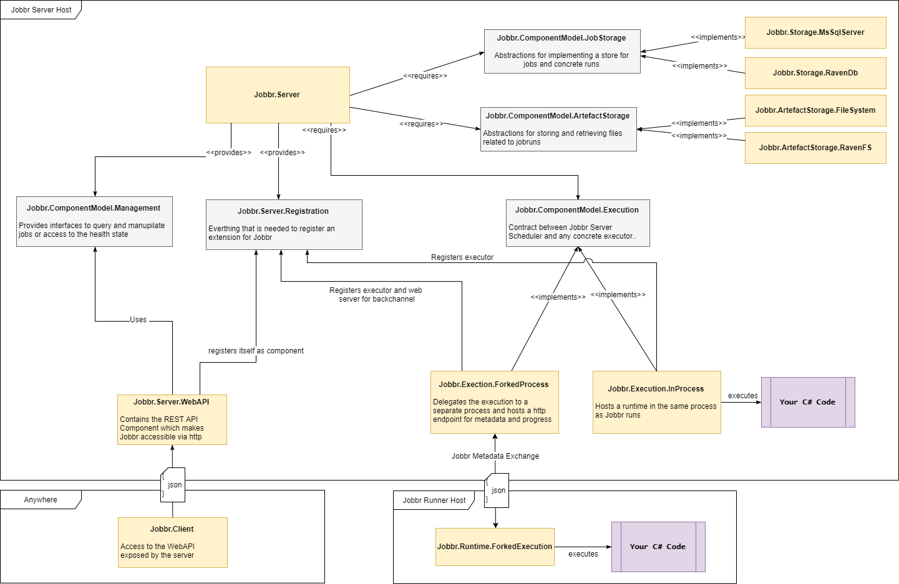

# Architecture
## General 
We're a library that enables running a JobServer in your very own application. This could be a console application or a windows server. We basically don't put any constraints on the environment as long as you are able to compile your code to an executable and include our assemblies. Jobbr is like a mediator that decouples your application from the actual logic in your jobs. So with this said, its both a library that comes with a very little framework or runtime where your jobs get executed.

> **Framework**: We don't like any lock-ins. Thats the reason why the constrains we put on your jobs are basicaly none. You simply have to implement a Run()-Method to be compatible with Jobbr. No references, no NuGets or dependencies in your jobs.

## Extendability
Concept of component models, Registration, different NuGet Packages, reasoining

List of CM and responsabilities? Very short to give an overview what is abstracted...

Picture and reasoning, can contain infos from meeting notes

--> Link to internas (if you want to implement a Component)
